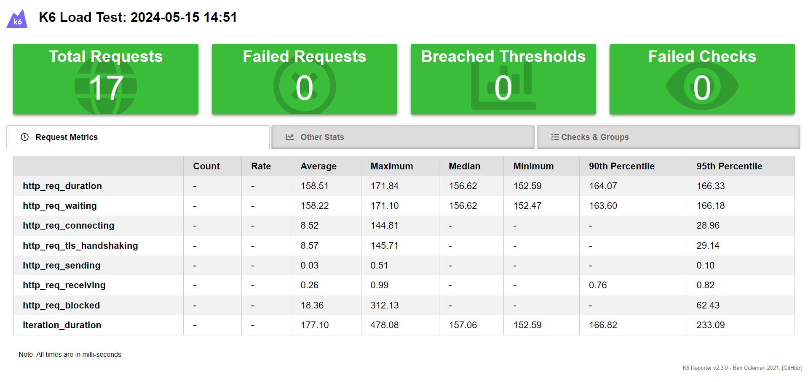
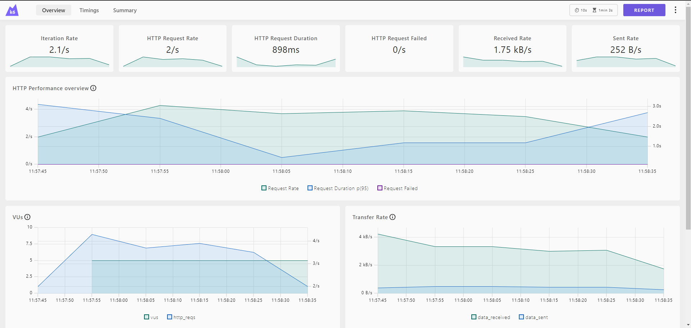
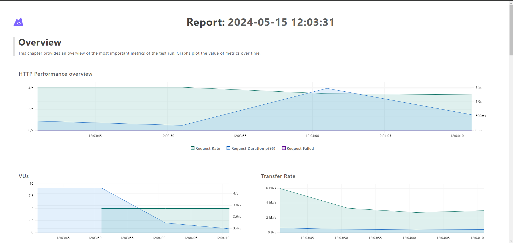

## 🚀 Introdução:

Através do framework K6 Performance Testing, foi utilizado algumas plataformas para aprendizagem práticas transmitidas no curso Teste de Performance com K6, Udemy.

## 📚 Aprendizagens:
- Instalação e configuração inicial do K6.
- Fundamentos dos testes de desempenho e terminologia relevante.
- Validação de respostas e elaboração de afirmações.
- Exploração da interface de linha de comando (CLI) do K6.
- Utilização das ofertas do Grafana Cloud K6 para uma experiência completa.
- Integração de testes K6 em servidores CI/CD renomados, como Jenkins, GitLab CI e Circle CI.

## 💻 Tecnologias e ferramentas
- K6
- JavaScript
- Grafana Cloud
- AWS
- Github Actions

## 🤖 Como executar
- Executar localmente

```
k6 run {nome do arquivo}.js
```

- Gerar relatórios em html

```
k6 run {nome do arquivo}.js
```

- Gerar relatórios em dashboard
    - Acessar o endereço para dashboard: http://localhost:5665/ 

```
K6_WEB_DASHBOARD=true k6 run {nome do arquivo}.js
K6_WEB_DASHBOARD=true K6_WEB_DASHBOARD_EXPORT={nome relatorio}.html k6 run {nome do arquivo}.js
```

## Grafana Cloud
- Comando para inserir o token ao projeto local no Gitbash/CMD
```
k6 login cloud --token {token gerado em Settings > Personal API token}
```

- Executar no Grafana Cloud

```
k6 cloud {nome do arquivo}.js
k6 run --out cloud {nome do arquivo}.js
```

## 📷 Evidências dos reports gerados após execução dos testes:
- Relatório HTML


- Relatório do Dashboard


- Relatório do Dashboard em HTML
